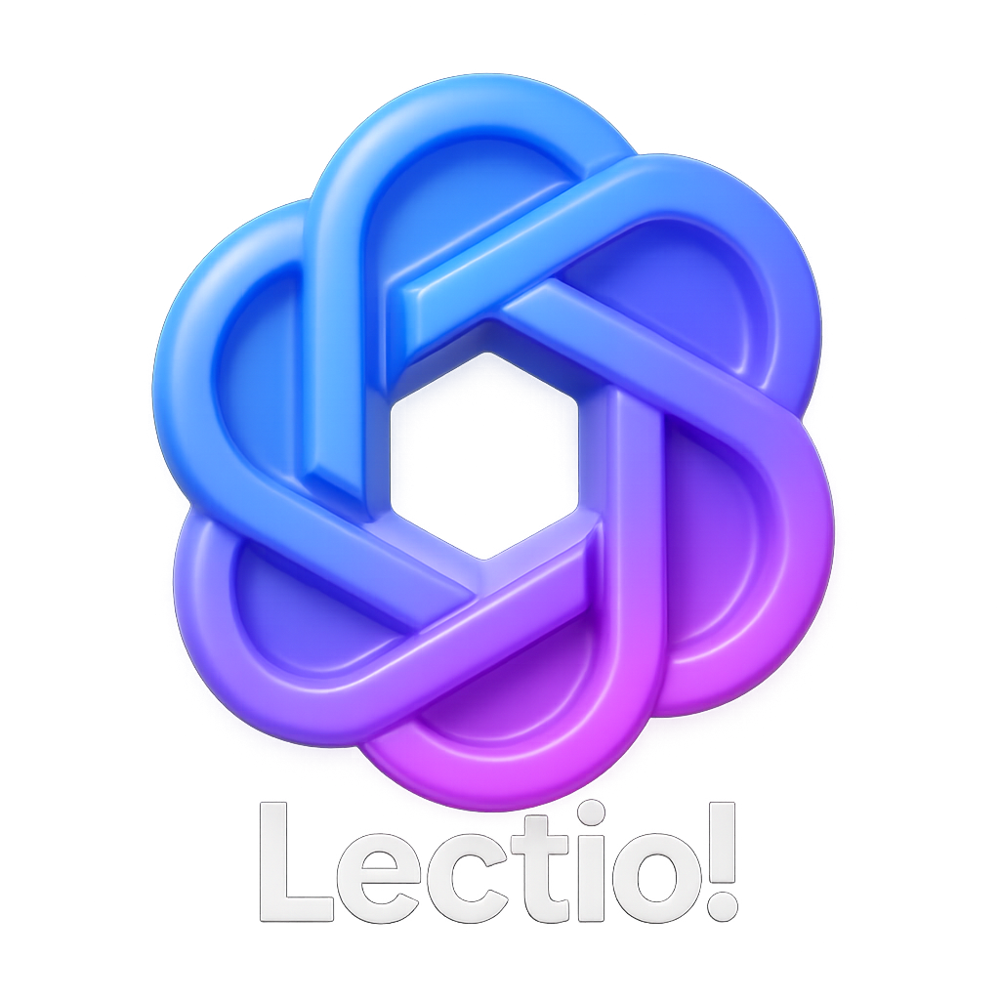

# Lectio: AI-Powered Video Lecture Assistant



## Overview

Lectio is an advanced AI-powered educational tool developed by Julian Bauer that transforms how students interact with video lectures. It enables active learning by allowing students to ask questions about lecture content in real-time, creating a personalized tutoring experience.

The application takes YouTube video lectures as input, transcribes the audio content using OpenAI's Whisper model, and then leverages GPT-4o to provide intelligent, contextual responses to student questions about the lecture material.

## Features

- **YouTube Video Integration**: Easily input any YouTube lecture URL
- **Automatic Transcription**: Converts lecture audio to text using OpenAI's Whisper model
- **Interactive Q&A**: Ask questions about any part of the lecture content
- **Real-time Responses**: Get immediate, contextually relevant answers
- **LaTeX Support**: Mathematical equations render properly in responses
- **User-friendly Interface**: Clean, intuitive web interface for seamless interaction
- **Markdown Formatting**: Responses support basic formatting like headings and bold text

## Technical Architecture

Lectio consists of three main components:

1. **Core Processing Module** (`app.py`):
   - Handles YouTube video downloading via yt-dlp
   - Manages audio extraction and processing
   - Interfaces with OpenAI APIs for transcription and chat functionality
   - Maintains conversation context for coherent interactions

2. **Web Server** (`server.py`):
   - Flask-based backend providing RESTful API endpoints
   - Manages state between the UI and processing components
   - Handles asynchronous requests for video processing and chat

3. **User Interface** (`html/index.html`):
   - Responsive web interface built with Bootstrap
   - Real-time chat functionality
   - Transcription display
   - Support for LaTeX rendering via MathJax

## Requirements

- Python 3.8+
- OpenAI API key
- Internet connection for YouTube access and API calls
- Modern web browser

## Installation

1. Clone the repository:
   ```bash
   git clone https://github.com/yourusername/lectio.git
   cd lectio
   ```

2. Install required Python packages:
   ```bash
   pip install flask openai yt-dlp
   ```

3. Set up your OpenAI API key as an environment variable:
   ```bash
   # On macOS/Linux
   export OPENAI_API_KEY="your-api-key-here"
   
   # On Windows
   set OPENAI_API_KEY="your-api-key-here"
   ```

## Usage

1. Start the Flask server:
   ```bash
   python src/server.py
   ```

2. Open your web browser and navigate to:
   ```
   http://127.0.0.1:5000
   ```

3. Enter a YouTube video URL in the input field and click the video icon to process it.

4. Wait for the transcription to complete (this may take a few minutes depending on the video length).

5. Once transcription is complete, you can start asking questions about the lecture content in the chat interface.

## Example Use Cases

- **Clarification of Complex Concepts**: "Can you explain the concept of quantum entanglement that was discussed at 15:30?"
- **Summary Requests**: "Summarize the key points about neural networks from this lecture."
- **Formula Explanations**: "Walk me through the derivation of the formula that was presented at 22:45."
- **Connections to Prior Knowledge**: "How does this information relate to what we learned about thermodynamics last week?"
- **Practical Applications**: "What are some real-world applications of the algorithms discussed in this lecture?"

## How It Works

1. **Video Processing**: When you submit a YouTube URL, Lectio downloads the audio track and converts it to MP3 format.

2. **Transcription**: The audio is sent to OpenAI's Whisper API, which returns a text transcription of the lecture.

3. **Context Building**: The transcription is stored in a memory buffer that provides context for the AI assistant.

4. **Interactive Q&A**: When you ask a question, it's sent to OpenAI's GPT-4o along with the lecture transcription context, allowing for informed, relevant responses.

## Limitations

- Transcription quality depends on the audio clarity of the original video
- Processing very long videos may take significant time
- Requires an active internet connection and OpenAI API key
- API usage incurs costs based on OpenAI's pricing structure

## Future Enhancements

- Support for additional video sources beyond YouTube
- Timestamp-based navigation of lecture content
- Local file upload capabilities
- Integration with learning management systems
- Collaborative session sharing

## Contact

Julian Bauer  
Email: julianbauervr@gmail.com

## Acknowledgments

- OpenAI for providing the API services that power this application
- yt-dlp project for YouTube download functionality
- Bootstrap and MathJax for frontend components
- UI belongs to a YouTube Tutorial for which I have lost the link. If this UI belongs to you, please contact me, and I will credit you.
